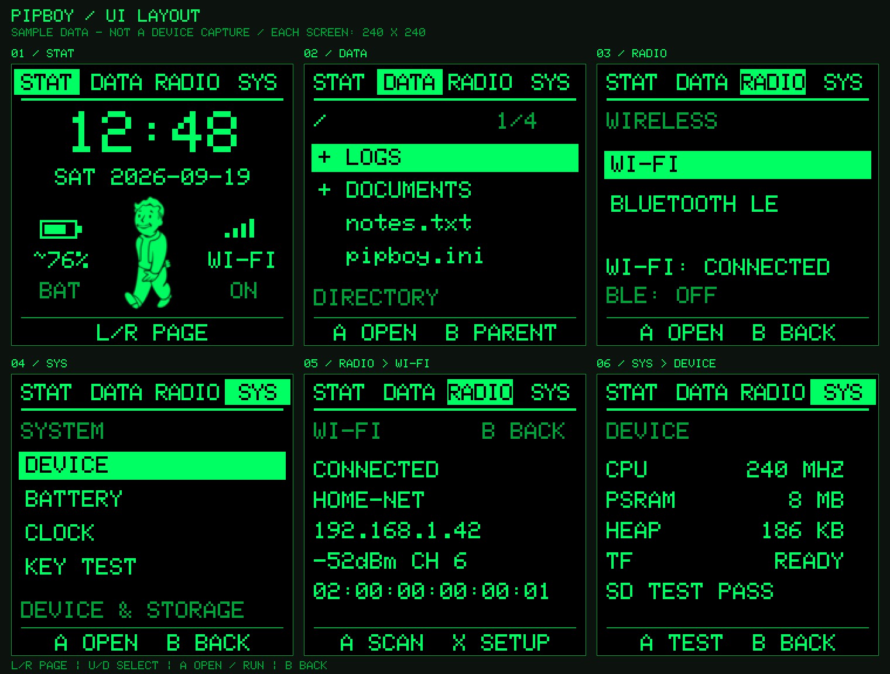
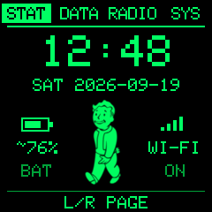
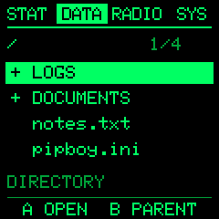
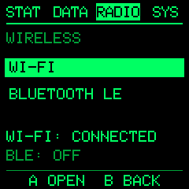
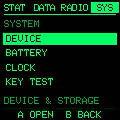
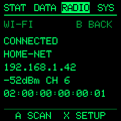
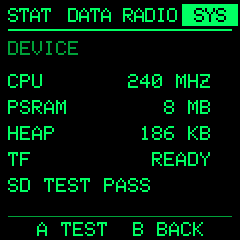

# PipBoy

[中文](README.zh-CN.md)



A green-terminal system monitor for the S3AI Game (ESP32-S3) handheld. Four
pages — clock and status, a read-only file browser, Wi-Fi and BLE scanning, and
a system panel with battery calibration and a key tester.

> **Fan project.** Fallout, Pip-Boy and Vault Boy are trademarks of Bethesda
> Softworks LLC. This is an unofficial, non-commercial hobby firmware with no
> affiliation with or endorsement by Bethesda. The mascot frames under
> `assets/` and `research/user-frames/` are derived from Vault Boy artwork and
> are **not** covered by this repository's MIT licence, which applies to the
> source code only.

## Pages

| | | |
|---|---|---|
|  |  |  |
| STAT | DATA | RADIO |
|  |  |  |
| SYS | RADIO > WI-FI | SYS > DEVICE |


Previews are rendered by `preview_ui.py` and `preview.py` from the firmware's
own glyph table and sprite frames, with sample data. They are a layout check,
not a device capture.

- **STAT** — 24-hour Beijing-time dot-matrix clock, English weekday and date,
  the four-frame mascot, a battery icon with an estimated percentage, and a
  Wi-Fi signal icon. Before the clock syncs it shows `--:--` and
  `DATE NOT SYNCED`. An invalid battery read shows `--% / CHECK` rather than
  pretending the pack is full.
- **DATA** — a four-row file list with path, position and file size. It never
  executes, deletes or rewrites what it browses. Long names are truncated, and
  Chinese filenames do not render correctly yet.
- **RADIO** — WI-FI and BLUETOOTH LE as a list. Scan results survive page
  switches. Provisioning and scanning are mutually exclusive.
- **SYS** — DEVICE, BATTERY, CLOCK and KEY TEST. DEVICE covers CPU, PSRAM, free
  heap, TF card and the read/write verification result.

## Keys

| Action | Key |
|---|---|
| Screen off / restore | APP (GPIO10), short press |
| Previous / next page | Left / Right |
| Jump to SYS | SELECT |
| Move in a list | Up / Down |
| Enter a directory or subpage | A |
| Back one level | B |
| Retry a failed TF mount | A on DATA |
| TF read/write verification | A on SYS > DEVICE |
| Reload battery calibration, resync clock | A on the BATTERY / CLOCK page |
| Wi-Fi provisioning | X on the Wi-Fi status page, or START anywhere |
| Scan nearby networks / BLE advertisers | A on the Wi-Fi / BLE page |
| Cycle scan results | X / Y |

Entering a subpage with A never starts a scan, a calibration or a TF test on its
own. There are no key combinations.

Auto-sleep after 10 s idle, suspended while provisioning, scanning or during
file operations, and the timer restarts once those finish.

## Install

The image is **application-only**. Install it with the Launcher SD file
browser; do not write it to flash offset `0x0`, and do not install
`firmware.factory.bin`, `partitions.bin` or `bootloader.bin` from `.pio`.

1. Copy `dist/PipBoy-v1.3.bin` anywhere on the TF card.
2. Pick it in the Launcher file browser. Launcher allocates the flash app
   partition and reboots into it.

`partitions.csv` here only serves the build; the real install location is
Launcher's decision.

**Returning to Launcher is not implemented.** On this device Launcher sits in
the `test` partition and the current bootloader has no shortcut to boot it, so
a reset may come back into this app. START is the provisioning shortcut, not a
way back. This firmware never modifies the partition table.

## Provisioning and clock

Press **START**, or X on the Wi-Fi status page. Every S3AI app raises the same
hotspot:

| Name | Password |
|---|---|
| `samestick` | `samestick` |

Join it from a phone; the page opens by itself, or browse to
`http://192.168.4.1/`. Pick a **2.4 GHz** network — the ESP32-S3 has no 5 GHz
radio. Hidden networks are the only case needing a typed name. Open networks
work with an empty password; WPA-Enterprise does not.

Credentials are written to the NVS namespace `pipboy-net` only after a
connection succeeds, so a wrong password never overwrites a working one, and
Launcher's own Wi-Fi settings are untouched. Passwords never reach the serial
log, the screen or the page. Offline, it retries every 30 seconds.
Provisioning does not need the TF card.

Time comes from NTP, fixed to UTC+8. Once synced the clock keeps running
through a network drop and through light sleep. After a power cycle the time is
unknown and shows `--:--`; the device has no battery-backed RTC and will not
pass off a saved timestamp as the current time.

Provisioning is handled by [wifi-portal](https://github.com/sameclub/wifi-portal),
vendored as a submodule. Its page styles are adapted from
[78/esp-wifi-connect](https://github.com/78/esp-wifi-connect) under MIT; the
notice ships in `lib/wifi-portal/LICENSE` and in `dist/esp-wifi-connect-MIT.txt`.

## Battery

GPIO8, `analogReadMilliVolts`, 12-bit ADC, 6 dB attenuation, 16 samples averaged
every two seconds and smoothed for display:

```
voltage = ADC millivolts * 4 / 1000 * battery_scale
```

The factor 4 comes from the 300 / 100 divider. Outside 2.5–4.5 V it shows
`CHECK ADC` rather than inventing a percentage.

The percentage is estimated from a single-cell lithium curve, 3.4 V as 0% and
4.2 V as 100%, marked with `~`. Real capacity also depends on load, temperature
and age. There is no charge-detect GPIO, so `CHARGE: UNKNOWN` means exactly
that.

To calibrate, copy `pipboy.ini.example` to the card root as `pipboy.ini`. Once
the reading is stable, measure the pack with a multimeter:

```
new scale = old scale * multimeter voltage / displayed voltage
```

Set `battery_scale` in the range 0.8–1.2 and press A on SYS > BATTERY to
reload. The default is 1.0 and has not been calibrated against hardware. If you
need a factor outside that range, check the divider instead of compensating.

## Wireless

RADIO > WI-FI shows connection state, SSID, IPv4, RSSI, channel and this
device's STA MAC. A starts an asynchronous scan; X / Y page through SSID, BSSID,
signal, channel and open/encrypted status; B returns.

BLE is off by default. A runs a 5-second passive advertisement scan showing
name (when advertised), address and RSSI, up to 12 results with a `+` when
there are more. These are advertising devices, not paired ones; nothing
connects. The ESP32-S3 has no classic Bluetooth. Wi-Fi and BLE scans run
serially.

## Storage

Every boot mounts the TF card over 1-bit SDMMC and creates a random
`/pipboy-check-xxxxxxxx.tmp` in the root, then writes, closes, reopens, verifies
and deletes it. Only that file is deleted, and a name collision is skipped. A
failure is displayed and logged; the card is never formatted and never silently
switched to SPI.

## Display and animation

Body text is a 2x integer-scaled dot matrix (12x16 px cells); the home clock is
the same font at 5x; tabs use 11 px spacing to fit RADIO. Each frame is composed
in a memory canvas and compared row by row, so only changed rows go to the
panel — the screen is never blanked first.

The mascot uses four 72x104 RGB565 frames at 160 ms each, generated by
`prepare_user_sprites.py` from `research/user-frames/` and compiled into
`src/walk_frames.h` (59904 bytes). Hue is remapped to the interface `GREEN`
(0x07ec), keeping only the source's shading and scanline gaps. Font and sprites
ship inside the binary; nothing extra is copied to the TF card.

## Build

```bash
pio run -e s3ai-pipboy
python package.py
```

`pio run` only produces `.pio/build/s3ai-pipboy/firmware.bin`. `package.py`
verifies it and writes `dist/`. The firmware and `package.py` must report the
same version or packaging aborts.

Dependencies resolve from the PlatformIO registry, and the board definition is
vendored under `boards/` (see [boards/NOTICE.md](boards/NOTICE.md)), so a clean
clone builds without any other checkout.

On Windows, enable long paths before the first build or the toolchain fails to
unpack:

```powershell
New-ItemProperty -Path "HKLM:\SYSTEM\CurrentControlSet\Control\FileSystem" -Name LongPathsEnabled -Value 1 -PropertyType DWORD -Force
```

Run PlatformIO from PowerShell or cmd, not Git Bash or MSYS. The platform
installs its compiler with `idf_tools.py`, which refuses to run under
MSys/Mingw and leaves the build failing on a missing `xtensa-esp32s3-elf-g++`.

Regenerate assets and previews (needs Pillow, and one `pio run` first so the
font is available):

```bash
python -m pip install Pillow
python prepare_user_sprites.py   # rebuilds src/walk_frames.h
python preview_ui.py             # six static screens + overview
python preview.py                # walk.gif
```

Rebuild and repackage after regenerating the sprite header.

## Status

The firmware builds and packages; esptool confirms an ESP32-S3 image with a
valid checksum and validation hash. Provisioning, clock, battery and scanning
have **not** been verified on hardware, and returning to Launcher is blocked by
the bootloader. Treat the numbers here as design intent rather than measured
results.

## Related

- [wifi-portal](https://github.com/sameclub/wifi-portal) — the shared provisioning library
- [DotMic](https://github.com/sameclub/dotmic) — push-to-talk USB microphone and clock
- [VoxStick](https://github.com/sameclub/voxstick) — desk terminal for local coding agents

## Licence

MIT for the source code, see [LICENSE](LICENSE). This does **not** extend to the
Vault Boy derived artwork under `assets/` and `research/user-frames/`, or to the
sprite data compiled from it in `src/walk_frames.h` and the shipped binary.
